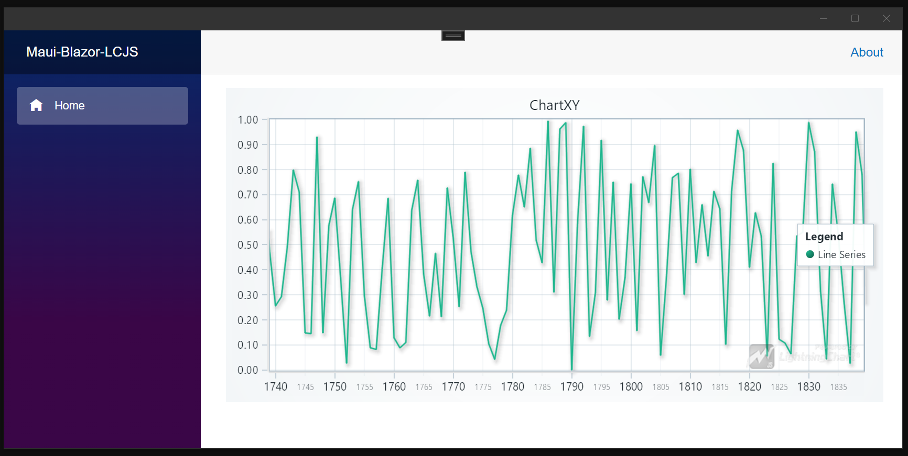

# Maui-Blazor-LCJS

This repository was initialized by following Microsoft's tutorial for [Build a .NET MAUI Blazor Hybrid app](https://learn.microsoft.com/en-us/aspnet/core/blazor/hybrid/tutorials/maui).

- Visual Studio 2022
- ASP .NET and web development workload required
- Using ".NET MAUI Blazor Hybrid App" template
- .NET 7.0

From there, the minimal steps were taken to put LightningChart JS inside the application.



## Add LightningChart JS as a JavaScript library dependency.

- Download `lcjs.iife.js` from a CDN service such as [jsdelivr](https://www.jsdelivr.com/package/npm/@arction/lcjs) and place the file in `wwwroot/js/`
- Register it as a global dependency in `wwwroot/index.html`

## Add JavaScript to the project to work with LightningChart JS

Found in `wwwroot/js/chart.js`. It is also registered in `wwwroot/index.html`.
This is a completely custom script that works together with the C# client application and communicates with LightningChart JS.

## Finally, use the custom JS script from a Razor component

- Render a `DIV` element that will house the LightningChart component

`<div id="chart"></div>`

- After component render, tell the JS script to display the chart in the DIV

```
@code {
    protected override async Task OnAfterRenderAsync(bool firstRender)
    {
        if (!firstRender)
        {
            return;
        }
        await JS.InvokeVoidAsync("createChart", "chart
    }
}
```

- Control the DIV layout using normal Razor methods. For example, by adding CSS in `wwwroot/css/app.css`

```css
#chart {
  width: 100%;
  height: 400px;
}
```

This should display an empty chart on the user interface.

## Data transfer using invoke JavaScript

Serialize data into a JSON string and invoke a JS side function with the string as its parameter to send data to the JS script and from there to LightningChart.
This is simple, robust, and fast enough for most use cases.

```
@using System.Text.Json;
Random random = new Random();
for (int i = 0; i < 5000; i += 1)
{
    var data = new {
         x = i,
         y = random.NextDouble()
    };
    await JS.InvokeVoidAsync("setChartData", "chart", JsonSerializer.Serialize(data));
    await Task.Delay(10);
}
```
